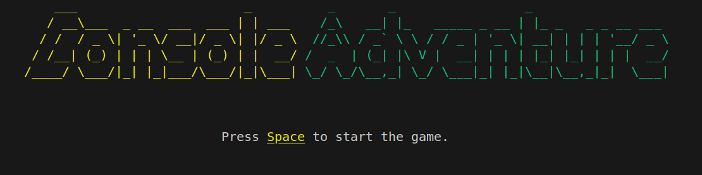
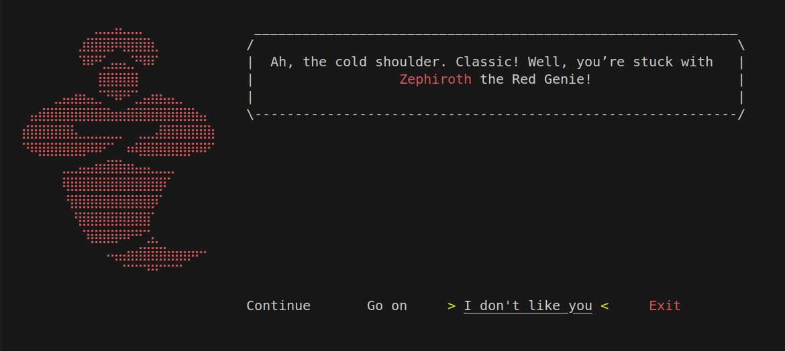
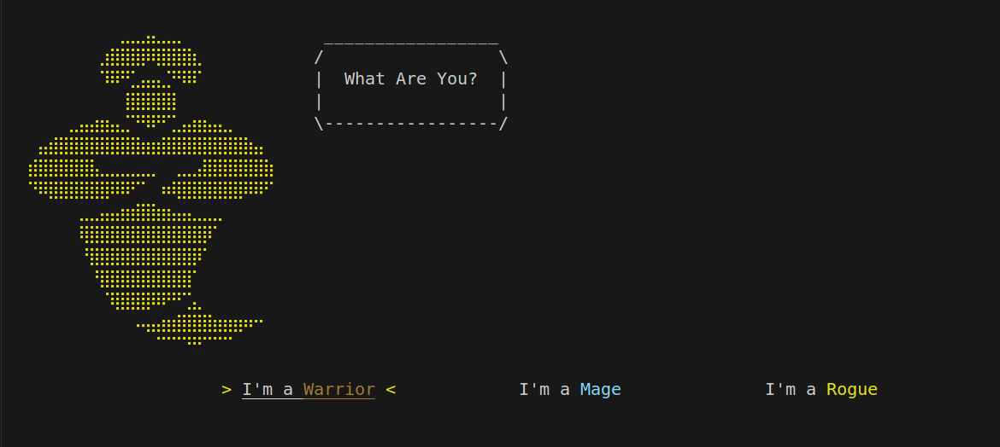
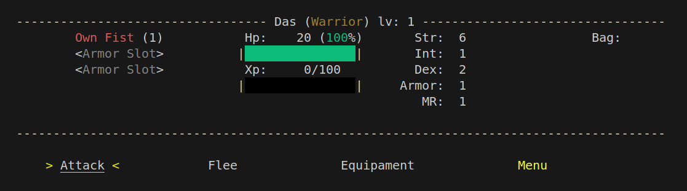

# Console Adventure

<span style="color:Yellow">Console</span> <span style="color:Green">Adventure</span> is a terminal fantasy game. Where 
the player wanders through the Magical Lands fighting enemies, getting gear and .
It was designed using OO patterns and only needs node.js to run.

# Requirements

1. ***[Node.js](https://nodejs.org/pt)*** (tested on 20.17.0 but should work anywhere)

# Running the Game
To run the game simply make sure you have node.js installed in your system, you can check by opening a terminal and running:

```shell
node --version
``` 

Then just download or clone this repo and change the folder to the game's folder:
```shell
cd ConsoleAdventure
```
and run main.js with node
```shell
node main.js
```

On Windows you can run the ConsoleAdventure.bat included
(which is just a script with ```node main.js``` and ```pause```) but you can also create shourt cuts to it and paste on the Desktop for example

# Devlogs
You can check out the development logs you can check here [Devlogs](/Game/Devlog/version0_3.md) documenting the changes in each version. (Separately from Changelogs)

# Web Version

You can try it now on the web [here](http://www.consoleadventure.com).

# Porting
* One of the powerful things about not using node packages such as Chalk is that it makes way easier for me to change and implement stuff  for each plataform more easily (in this case if I use Chalk and I have to change how the output handles color i'm ducked)

* *However I do recognize that using such package can greatly increase maintainability and readability*.

In order to make it compatible with anything you just need to port a few thing:
* Show it how to print by reassigning ConsoleBasic.write().
* Show it how to clear a screen.
* A way to it get the current width.
* A way to capture input.
* *[Optionally]* Other functions, if not printing to a console, like how to show and hide cursor, how to insert colors

### Example:
For the website I made it compatible with Xterm.js and React by using the following:

```Javascript
    ...
        const CH = new BasicConsole(); // Only 1 Instance Anywhere.
        // https://www.qovery.com/blog/react-xtermjs-a-react-library-to-build-terminals/
        const { instance, ref } = useXTerm(); 
        // game instance
        const game = useRef(null);
        ...
        // how to know the current console size
        CH.getWidth = () => {
            return instance?.cols
        }
        // how to write
        CH.write = (text) => {
            instance?.write(text)
        }
        // how to clear screen
        CH.clear_screen = () => {
            instance?.clear()
            CH.clear_line()
        }
        //Passes Input to the Game
        instance?.onKey(key => {
            // CNTR+B -> Enters Dev Mode
            if (key.key === `\x02`) {
                //toggleDevMode
                DevMode.getInstance().setValue()
                //Renders the entire Terminal Screen again
                GameStates.rerender();
            }
            else {
                if (key.key) {
                    //Passes the input to the game
                    if (key.domEvent.key.toLowerCase() === " ")
                        game.current.handleInput("space");
                    else
                        game.current.handleInput(keydomEvent.keytoLowerCase());
                    }
                    //Renders only what need to be render
                    GameStates.render();
                }
            })

        ...
...
```


# Future Features

Some features that are still not implemented but are coming soon:
0. Make the ConsoleBasic class more easily extandable (instead of the current function overload) for the xterm and other ports and force such inheritances for the ports.
1. Save and load Game
3. Story mode: Right now the only game mode available is Gauntlet Mode (no choice auto goes into it in the new game) but a story mode is coming soon
4. Maps: players will be set in a location and will be able to choose where to go, see where they are etc.
5. Final boss: class that will be part of the story mode.
6. Gamepad support


# Preview

### 5 Mysterious Genies


### 3 Classes






### And a lot of Adventure!


