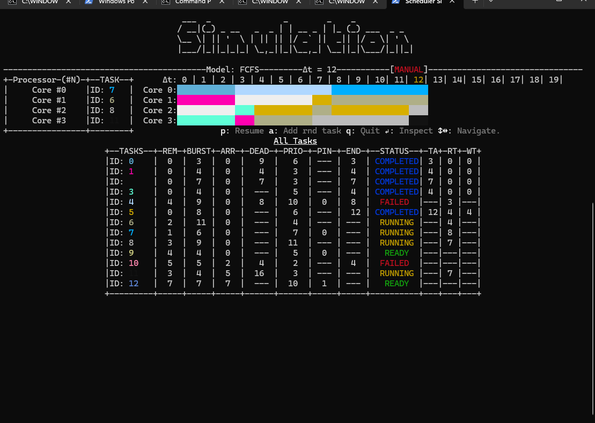
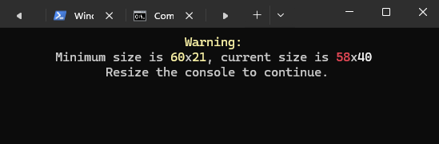
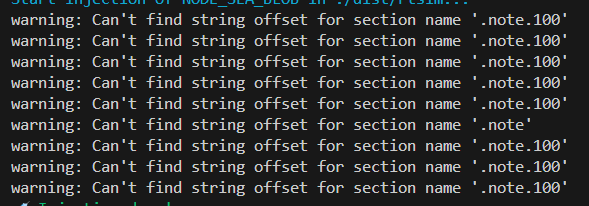

# RTSim

RTsim is discrete time preemptive scheduler simulator that can simulate different scheduling algorithm with one or more cpus. It allows for a visulization of the scheduler at any discrete point in time.

It uses a sudo-engine (~~that I need to decouple from here~~) to draw a scene into the console at close to 60 (or 30) fps. and should be easily ported to other plataforms such as xterm.js.



And it is responsible!



Currently available scheduler models:

* EDF
* FCFS
* HRRN
* Priority
* Round Robin
* SJF

Future plans:

* Priority Queue

# Requirements

* With the source code:
  1. ***[Node.js](https://nodejs.org/pt)*** (tested on 20.17.0 but should work on any version)***[Node.js](https://nodejs.org/pt)*** (tested on 20.17.0 but should work on any version)
* With release version:
  1. *Nothing.*

# Running the Simulator

There are release versions available [here](/released "Release binaries") for windows and linux.

Alternatively, with the source code, simply make sure you have node.js installed in your system, you can check by opening a terminal and running:

```shell
node --version
```

Then just download or clone this repo and change the folder to the game's folder:

```shell
cd RTSim
```

and run main.js with node

```shell
node main.js
```

or

```shell
npm run start
```

*note:* if we pass the `-s` flag, the simulation will start as soon as the program starts with the default configs (~~or with a config json as soon as I get to it~~).

# Build

To build the app into an standalone executable binary I used Node's own SEA.

There build scripts available that follows the steps on Node's documentation.

* Windows:

```shell
./build.bat [realtive folder] [-c]
```

* Linux

```shell
./build.sh [realtive folder] [-c]
```

Note: on linux, during the injectiong of the executable, the following warnings appear:



I don't know where those come from but
it didn't seam to affect the executable .

#### Using [node SEA](https://nodejs.org/api/single-executable-applications.html) to build an executable:

0. Create `sea-config.json`:
   * ``echo '{"main": "dist/bundle/index.cjs", "output": "sea-prep.blob"}' > sea-config.json``
1. Bundle (with ESbuild):
   * ``npx esbuild main.js --bundle --outfile=dist/bundle/index.cjs --platform=node``
2. Create the node SEA blob:
   * ``node --experimental-sea-config sea-config.json``
3. Create the executable:
   * Windows: ``node -e "require('fs').copyFileSync(process.execPath, 'rtsim.exe')"``
   * Linux: ``cp $(command -v node) rtsim``
4. Inject the executable:
   * Windows: ``npx postject rtsim.exe NODE_SEA_BLOB sea-prep.blob --sentinel-fuse NODE_SEA_FUSE_fce680ab2cc467b6e072b8b5df1996b2``
   * Linux: ``npx postject rtsim NODE_SEA_BLOB sea-prep.blob --sentinel-fuse NODE_SEA_FUSE_fce680ab2cc467b6e072b8b5df1996b2 ``
